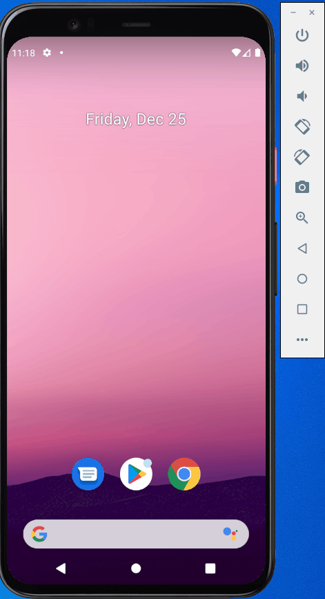
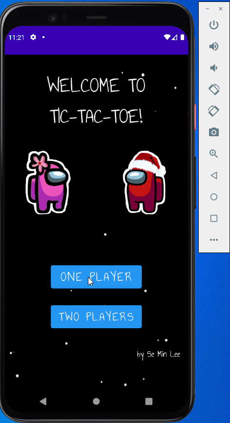
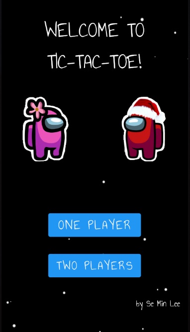
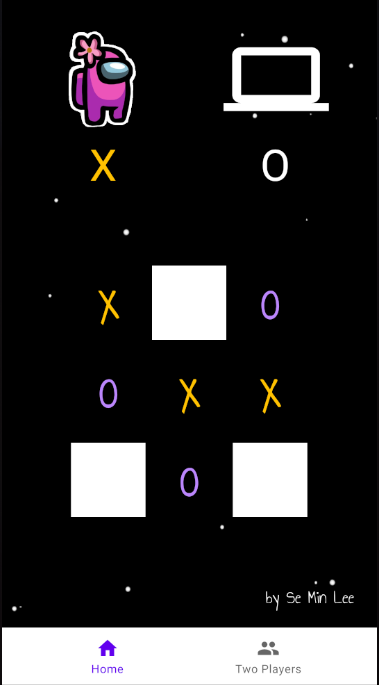
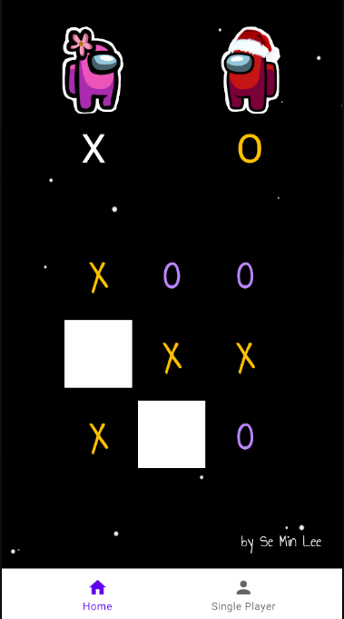
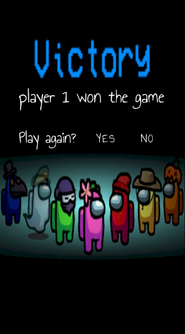

# 🕹️🕹️🕹️Tic-Tac-Toe🕹️🕹️🕹️

## About✅
This is a simple Tic-Tac-Toe game with Among-us theme.
A user can play against computer or with another friend.
There are few improvements that I would like to work on in the future.

## Stretch goals✅
- Fix any bugs in the app
- Add another activity that will have inputs for users to write their name, so when they win, the winner's name will appear in the screen.
- Add more devices with more diverse screen sizes, such as tablet and pc.

## Used...✅
- Android Studio 4.1.1
- Kotlin

## 🚀🚀🚀Into the app 🚀🚀🚀

#### A splash screen to main screen

 
 

#### Main screen to single player/two players to game and to victory page

 
 

## Developer✅
### Se Min Lee
- email: seminlee2794@gmail.com
- github: https://github.com/Seminlee94
- linkedin: https://www.linkedin.com/in/se-min-lee-149188105/
- medium: https://medium.com/@mlsml94
- portfolio: https://seminlee94.github.io/semin/

